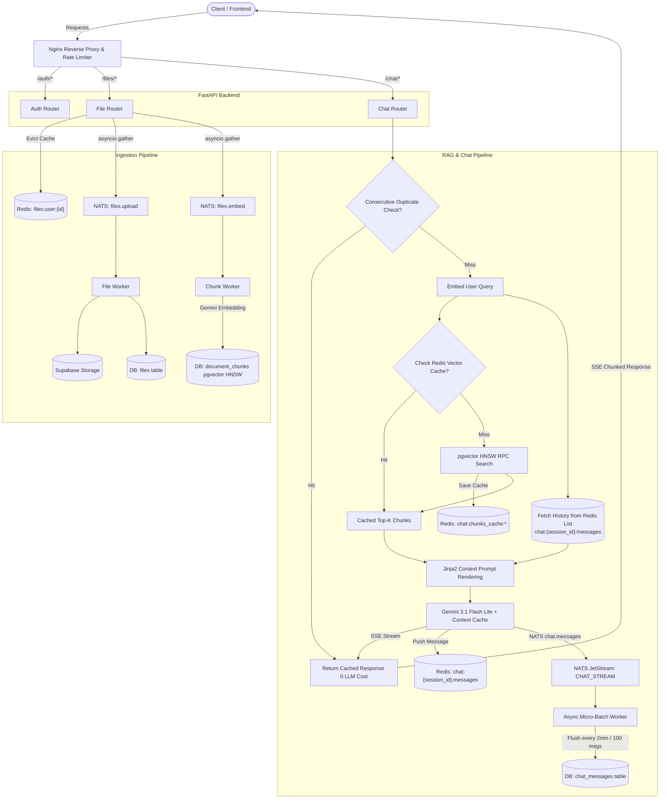

# FastAPI + AI (RAG) Backend

Upload a text document, have it chunked and embedded into vectors, and chat with it — answers are streamed back in real-time using Retrieval-Augmented Generation.

Built with FastAPI, PostgreSQL (pgvector), NATS JetStream, Redis, Nginx, and Google Gemini.

---

## How It Works

You upload a `.txt` file. Behind the scenes, it gets split into overlapping chunks, each chunk gets embedded into a 1024-dimensional vector via Google's `gemini-embedding-001`, and those vectors land in a `document_chunks` table in PostgreSQL with a pgvector HNSW index.

When you ask a question, the query itself gets embedded, the system runs a cosine similarity search against those stored chunks, grabs the top 5 most relevant ones, and feeds them as context — along with the last few conversation turns — into Gemini `3.1 Flash Lite`. The response streams back to you chunk-by-chunk via Server-Sent Events.

The upload doesn't block. The chat doesn't wait for DB writes. Everything that can be async, is.

---

## Architecture



---

## Why These Technologies

### NATS JetStream

The file processing pipeline needs to be async — when a user uploads a document, the API should return immediately with a `file_id` and "queued" status, not wait around while 15 chunks get embedded one by one. That's the job of a message broker.

Kafka would've worked but it's heavy for a single-node setup — you're dealing with Zookeeper (or KRaft), partition management, and a much larger operational surface. RabbitMQ is solid but NATS with JetStream gives us durable message delivery, consumer acknowledgment, and replay — all in a single binary under 20MB. It starts in milliseconds, needs zero configuration beyond enabling JetStream, and the `nats-py` client is async-native which fits perfectly with FastAPI.

There are two streams:

- **`FILES_STREAM`** handles the upload pipeline. When a file comes in, the router publishes two events concurrently via `asyncio.gather()` — one for raw file storage (`files.upload`) and one for chunk embedding (`files.embed`). Two separate NATS workers pick these up independently.

- **`CHAT_STREAM`** handles chat message persistence. Instead of writing every user/assistant message to PostgreSQL immediately (which would be an INSERT on every single chat turn), messages get published to `chat.messages` and a batch writer accumulates them in memory, flushing to the DB every 2 minutes or every 100 messages — whichever comes first. Redis holds the hot copy in the meantime so reads are instant.

### Redis — and where it's actually used

Redis isn't here as a "nice to have". It's doing real work across multiple layers:

**Chat history hot-cache** — Every chat message (user + assistant) gets appended to a Redis list (`chat:{session_id}:messages`) the moment it's generated. When the next query comes in and needs the last 10 messages for context, they're read from Redis — not from PostgreSQL where they might not even be flushed yet (because of the NATS micro-batching). This is the only reliable source of truth for recent messages.

**Vector search result caching** — When a query gets embedded and we run a pgvector similarity search, the results (top-K chunks) get cached under `chat:chunks_cache:{file_id}:{md5(vector)}`. If the same or a very similar query hits again, we skip the pgvector RPC entirely. For a RAG system where users often rephrase slightly or ask follow-ups that produce similar embeddings, this saves a meaningful number of DB round-trips.

**Session and file list caching** — Session metadata, user session lists, file-scoped session lists, and the `GET /files` response all get cached with automatic eviction. When a user creates a new session, the relevant list caches get evicted so stale data doesn't show up. When a user uploads a new file, the file list cache for that user gets cleared. These are small things but they add up when every API call otherwise hits Supabase over the network.

Here's the full picture of what's cached, for how long, and when it gets invalidated:

| Cache Key | What It Stores | TTL | Evicted When |
|---|---|---|---|
| `files:user:{user_id}` | `GET /files` response | 30 min | User uploads a new file |
| `chat:session:{session_id}` | Session metadata lookup | 1 hour | — |
| `chat:user:{user_id}:sessions` | All sessions for a user | 30 min | New session created |
| `chat:file:{file_id}:user:{user_id}:sessions` | Sessions scoped to a file | 30 min | New session created |
| `chat:{session_id}:messages` | Conversation history (Redis list) | 1 hour | — |
| `chat:chunks_cache:{file_id}:{vec_hash}` | Top-K similarity search results | 1 hour | — |

### Consecutive Duplicate Query Detection — the cheapest optimization

This one came from watching real usage patterns. Users sometimes hit send twice, or re-ask the same question because the stream didn't render fast enough. Each duplicate query would normally trigger an embedding call, a pgvector search, and a full Gemini generation — easily the most expensive operation in the system.

The fix is simple: before doing any of that, look at the last user message in the conversation history. If it's identical to the current query (case-insensitive, trimmed), grab the assistant response that followed it and serve that directly. No embedding, no vector search, no LLM call. The response comes back from Redis in under a millisecond.

This isn't a general semantic cache — it only catches exact consecutive duplicates. But those are surprisingly common, and each one saved is ~$0 in API cost and ~2-3 seconds of latency eliminated.

### Nginx — edge rate limiting

Rate limiting is handled at the Nginx layer, not in the application. Two zones:

- **General API**: 10 requests/second per IP with a burst of 20.
- **Chat streaming**: 15 requests/minute per IP with a burst of 5.

The chat limit is stricter because each streaming request holds a connection open and triggers an LLM call. Nginx returns a clean JSON 429 response (`{"detail":"Too many requests. Rate limit exceeded.","status_code":429}`) and the FastAPI exception middleware picks up and logs these to the `error_logs` table.

SSE streaming works through Nginx because `proxy_buffering` is disabled and `chunked_transfer_encoding` is off for the `/chat/session/` location — otherwise Nginx would buffer the entire Gemini response before sending it to the client, defeating the purpose of streaming.

### HNSW over IVFFlat — for pgvector indexing

HNSW was chosen because:

- **No tuning required** — IVFFlat needs you to pick `nlist` (number of clusters) and `nprobes` (how many to search) and get them right for your data distribution. HNSW works well out of the box with `m=16` and `ef_construction=64`.
- **No retraining** — IVFFlat clusters become stale after large inserts and need periodic `REINDEX`. HNSW maintains its graph incrementally.
- **Consistent latency** — HNSW queries are O(log N). IVFFlat query speed depends heavily on how many probes you configure vs. how many clusters exist.

The trade-off is memory — HNSW uses more (~12-15 MB per 10k chunks at 1024 dimensions). At the scale of document-level RAG, this is negligible.

---

## Project Structure

```
Backend/
├── .env.example
├── Dockerfile
├── requirements.txt
├── migrations/
│   ├── 01_auth.sql
│   ├── 02_files_and_embeddings.sql
│   ├── 03_chat.sql
│   └── 04_error_logs.sql
└── src/
    ├── config.py              # Pydantic settings
    ├── main.py                # App, lifespan, middleware, routers
    ├── Config/
    │   ├── database.py        # Supabase client
    │   ├── nats.py            # JetStream connection + streams
    │   └── redis.py           # Redis connection
    ├── Schema/                # Pydantic models (request/response)
    ├── routes/
    │   ├── auth.py            # /auth/signup, /auth/login
    │   ├── file.py            # /files/upload, /files, /files/{id}/status
    │   └── chat.py            # /chat/* endpoints
    ├── services/
    │   ├── auth_service.py    # Signup/login logic
    │   ├── file_service.py    # File queries, Redis caching, status
    │   ├── embedding_service.py  # Gemini embeddings + pgvector
    │   ├── chat_service.py    # Sessions, messages, similarity search, duplicate caching
    │   └── llm_service.py     # Gemini SDK, Jinja2, Context Caching, streaming
    ├── events/
    │   ├── schema/            # Event payloads
    │   ├── publisher/         # NATS publish functions
    │   └── subscriber/        # Workers (file, chunk, chat batch)
    ├── middleware/
    │   ├── auth.py            # JWT verification
    │   └── exception.py       # Error logging (4xx + 5xx → DB)
    ├── templates/
    │   ├── system_prompt.j2   # System instruction
    │   └── context_prompt.j2  # RAG context + history + query
    └── utils/
        ├── security.py        # bcrypt, JWT encode/decode
        └── chunking.py        # Text chunking
nginx/
└── nginx.conf                 # Rate limiting + reverse proxy
docker-compose.yml             # Nginx + Backend + NATS + Redis
nats-server.conf               # JetStream config
```

---

## Getting Started

### Prerequisites

- Python 3.12+
- A [Supabase](https://supabase.com) project (free tier works)
- A [Google AI Studio](https://aistudio.google.com) API key
- Docker (if using Docker Compose) or NATS + Redis installed locally

### 1. Clone & Install

```bash
git clone https://github.com/utakarsh23/APPSCRIP.git
cd BC06/Backend

python3 -m venv venv
source venv/bin/activate
pip install -r requirements.txt
```

### 2. Configure Environment

```bash
cp .env.example .env
```

Fill in your values:

| Variable | What It Is |
|---|---|
| `SECRET_KEY` | Random string for signing JWTs |
| `SUPABASE_URL` | Your Supabase project URL |
| `SUPABASE_KEY` | Supabase `service_role` key (Project Settings → API) |
| `GEMINI_API_KEY` | Google AI Studio API key |
| `GEMINI_MODEL` | Chat model (default: `gemini-3.1-flash-lite`) |
| `HF_TOKEN` | HuggingFace token (optional embedding fallback) |
| `NATS_URL` | Default: `nats://localhost:4222` |
| `REDIS_URL` | Default: `redis://localhost:6379` |

### 3. Run Database Migrations

In your Supabase Dashboard → SQL Editor, run these in order:

1. `migrations/01_auth.sql`
2. `migrations/02_files_and_embeddings.sql`
3. `migrations/03_chat.sql`
4. `migrations/04_error_logs.sql`

### 4. Start Everything

#### Docker Compose

```bash
docker compose up --build
```

Starts Nginx (`:80`), FastAPI (`:8000`), NATS JetStream (`:4222`), and Redis (`:6379`) with health checks and dependency ordering.

#### Manual

```bash
# Terminal 1
nats-server -js

# Terminal 2
redis-server

# Terminal 3
cd Backend && source venv/bin/activate
uvicorn src.main:app --reload --port 8000
```

Check: `http://localhost:8000/health` → `{"status": "ok", "environment": "development"}`

---

## API Endpoints

All endpoints except `/auth/*` and `/health` require `Authorization: Bearer <token>`.

### Auth
| Method | Endpoint | Description |
|---|---|---|
| `POST` | `/auth/signup` | Register (`username`, `email`, `password`) |
| `POST` | `/auth/login` | Login → JWT token |

### Files
| Method | Endpoint | Description |
|---|---|---|
| `POST` | `/files/upload` | Upload `.txt` → `file_id` + "queued" |
| `GET` | `/files/{file_id}/status` | Processing status + chunk count |
| `GET` | `/files` | List user's files |

### Chat
| Method | Endpoint | Description |
|---|---|---|
| `POST` | `/chat/session` | Create session for a `file_id` |
| `GET` | `/chat/sessions/{file_id}` | Sessions for a file |
| `GET` | `/chat/sessions` | All user sessions |
| `GET` | `/chat/session/{id}/messages` | Conversation history |
| `POST` | `/chat/session/{id}` | Query → SSE streaming response |

---

## Quick Test

```bash
# Sign up
curl -X POST http://localhost:8000/auth/signup \
  -H "Content-Type: application/json" \
  -d '{"username": "testuser", "email": "test@example.com", "password": "password123"}'

# Login
TOKEN=$(curl -s -X POST http://localhost:8000/auth/login \
  -H "Content-Type: application/json" \
  -d '{"email": "test@example.com", "password": "password123"}' \
  | python3 -c "import sys,json; print(json.load(sys.stdin)['access_token'])")

# Upload
curl -X POST http://localhost:8000/files/upload \
  -H "Authorization: Bearer $TOKEN" \
  -F "file=@your_document.txt"

# Check status
curl http://localhost:8000/files/<file_id>/status \
  -H "Authorization: Bearer $TOKEN"

# Create chat session
SESSION_ID=$(curl -s -X POST http://localhost:8000/chat/session \
  -H "Authorization: Bearer $TOKEN" \
  -H "Content-Type: application/json" \
  -d '{"file_id": "<file_id>", "title": "My Chat"}' \
  | python3 -c "import sys,json; print(json.load(sys.stdin)['session_id'])")

# Chat (streaming)
curl -N -X POST http://localhost:8000/chat/session/$SESSION_ID \
  -H "Authorization: Bearer $TOKEN" \
  -H "Content-Type: application/json" \
  -d '{"query": "What are the key points?"}'
```

---

## Error Logging

A global middleware intercepts every HTTP response. Anything ≥ 400 gets logged to the `error_logs` table in Supabase — that includes 401s from bad tokens, 429s from rate limits, 400s from validation failures, and 500s from unhandled crashes.

Each entry captures `timestamp`, `endpoint`, `http_method`, `error_message`, `stack_trace` (for 500s), `ip_address` (respects `X-Forwarded-For` from Nginx), and `user_id` if the request was authenticated.

---

## Tech Stack

| Component | Technology |
|---|---|
| Framework | FastAPI |
| Database | PostgreSQL (Supabase) + pgvector |
| Storage | Supabase Storage |
| Message Broker | NATS JetStream |
| Cache | Redis |
| Reverse Proxy | Nginx |
| Embeddings | Google GenAI `gemini-embedding-001` (1024-dim) |
| Chat LLM | Google Gemini `3.1 Flash Lite` |
| Auth | JWT (HS256) + bcrypt |
| Prompts | Jinja2 |
| Containerization | Docker Compose |
