# Visual Endpoint Walkthrough & Screenshots

This document provides visual proof of execution for all system endpoints, NATS event pipeline, vector similarity search, SSE chat streaming, Redis duplicate query caching, and Supabase telemetry logging.

---

## 1. Authentication

### Signup (`POST /auth/signup`)
Registers a new user, hashes the password using `bcrypt` (with 72-byte max length handling), and persists the record to the PostgreSQL `users` table.

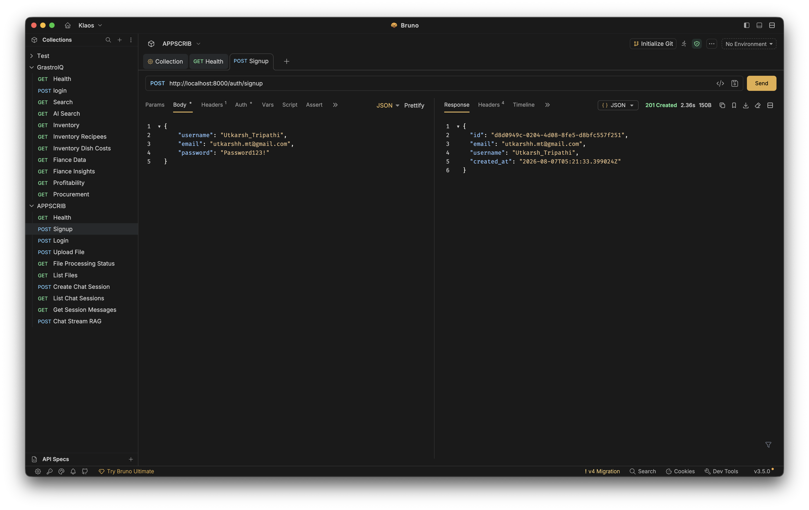

---

### Login (`POST /auth/login`)
Authenticates credentials and returns a signed HS256 JWT access token for Bearer Authorization.

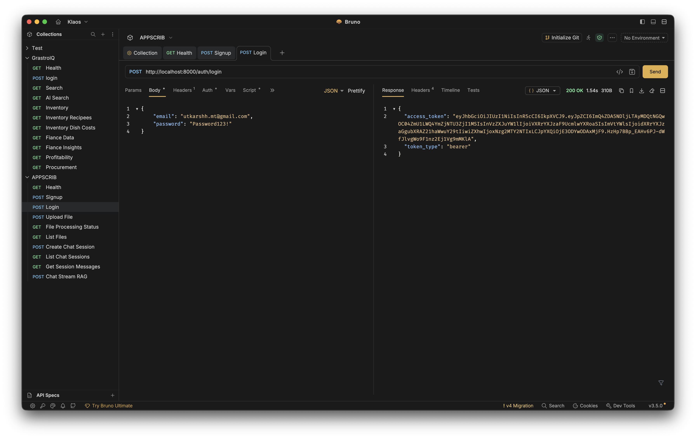

---

## 2. Document Ingestion Pipeline

### File Upload (`POST /files/upload`)
Enqueues raw file storage (`files.upload`) and chunk embedding generation (`files.embed`) concurrently into NATS JetStream, returning `202 Accepted` immediately with a generated `file_id`.

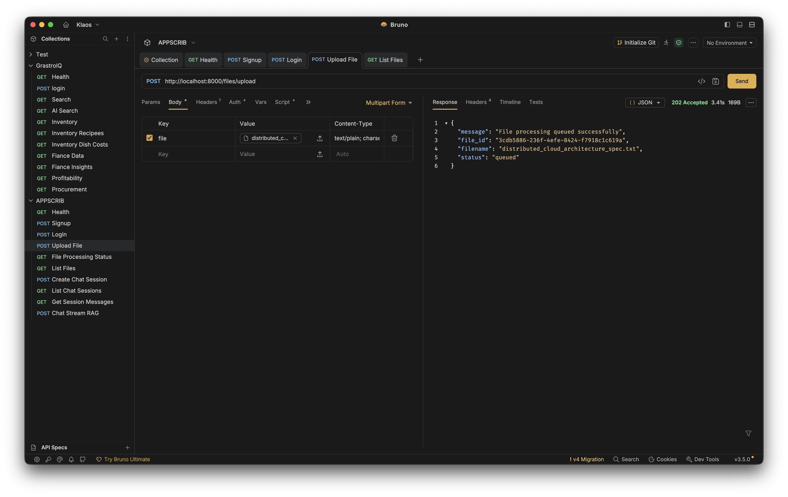

---

### File Processing Status (`GET /files/{file_id}/status`)
Tracks the real-time processing status (`queued` $\rightarrow$ `completed`) and total chunk count embedded by the NATS background worker.

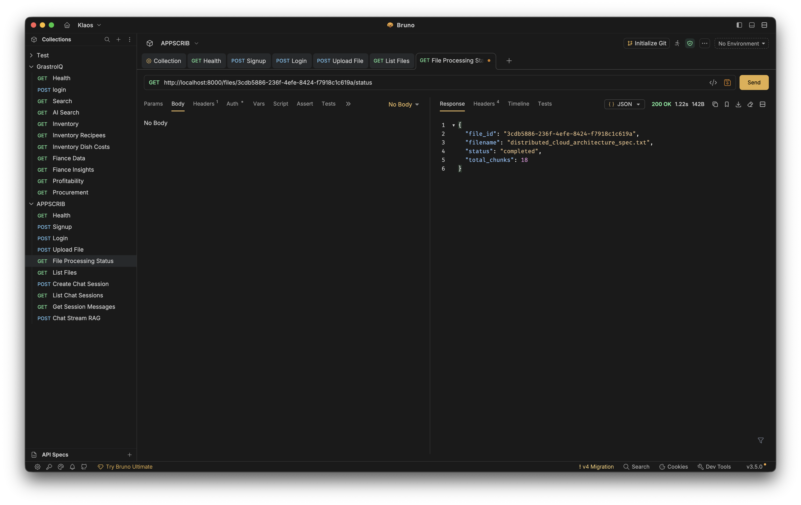

---

### List Uploaded Files (`GET /files`)
Returns all active files uploaded by the authenticated user, served directly from Redis cache (`files:user:{user_id}`).

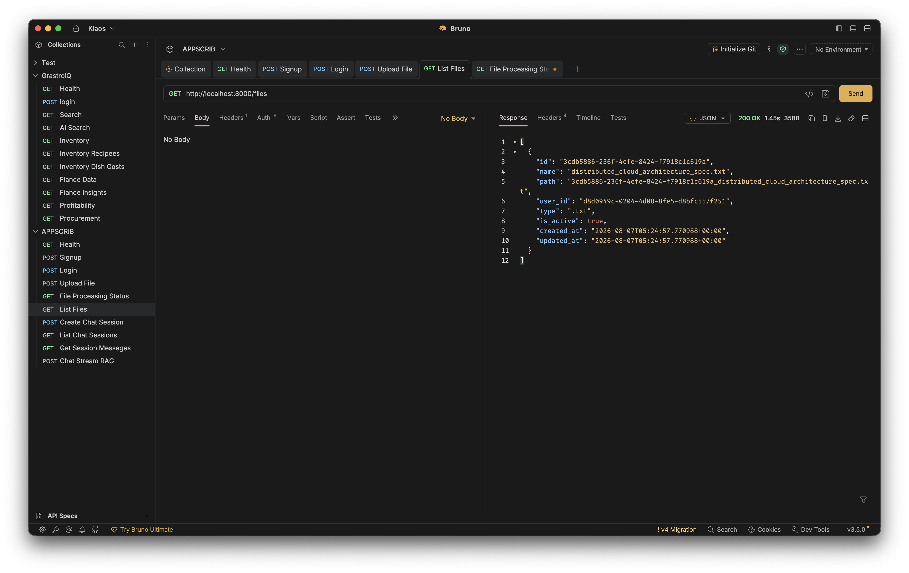

---

## 3. RAG Chat Sessions

### Create Chat Session (`POST /chat/session`)
Creates a new conversation session linked to a specific `file_id` and automatically invalidates session list caches.

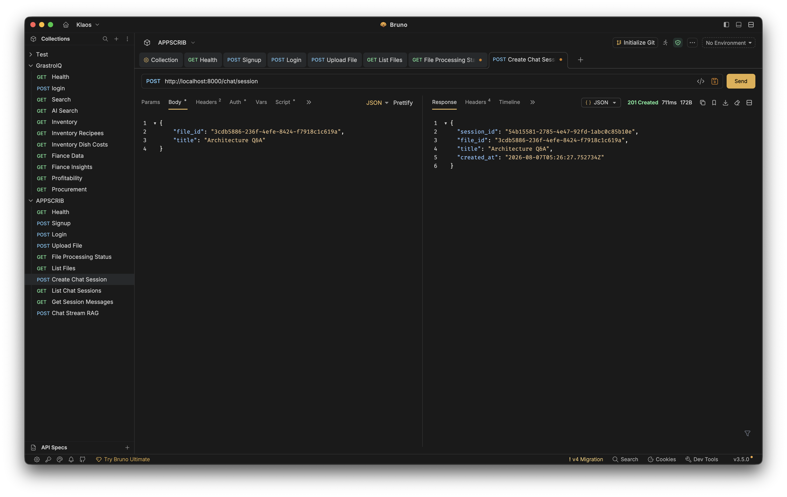

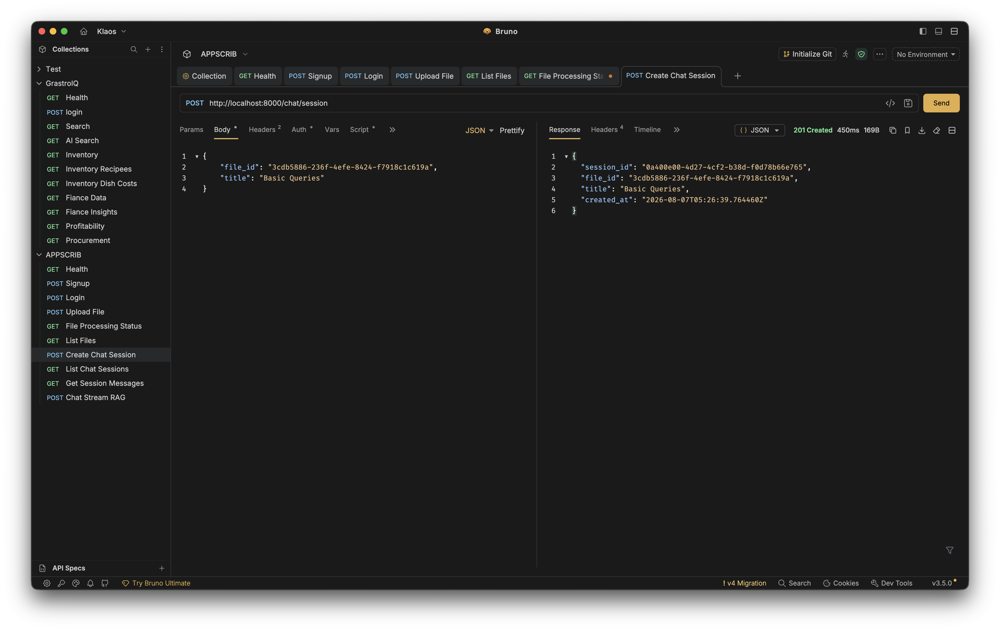

---

### List Chat Sessions (`GET /chat/sessions`)
Retrieves all chat sessions created by the user.

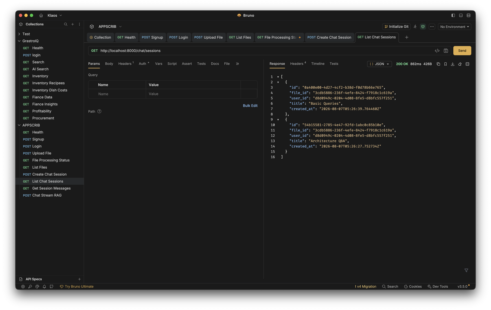

---

### Get Session Message History (`GET /chat/session/{session_id}/messages`)
Fetches exact chronological conversation history turns directly from the Redis hot-cache list (`chat:{session_id}:messages`).

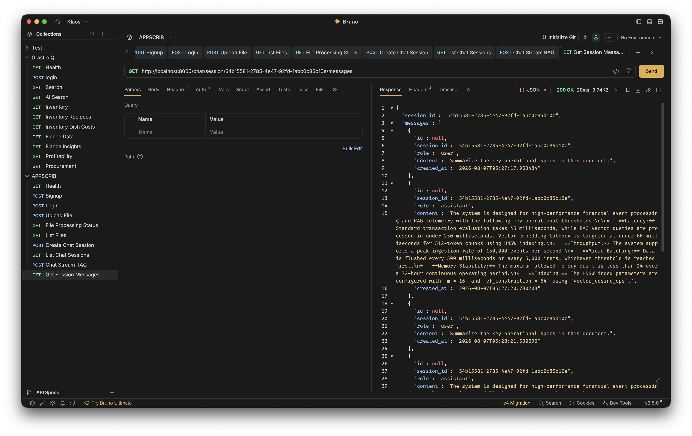

---

## 4. RAG Chat & SSE Streaming

### Streaming RAG Query (`POST /chat/session/{session_id}`)
Embeds the query via `gemini-embedding-001`, performs top-K cosine similarity search against `pgvector` HNSW index, renders Jinja2 prompts, and streams real-time responses chunk-by-chunk using Server-Sent Events (SSE).

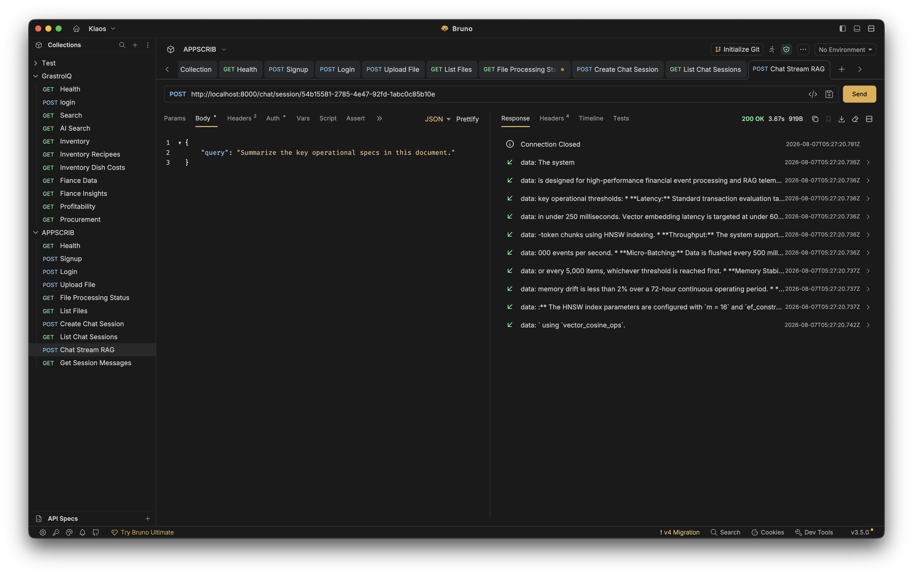

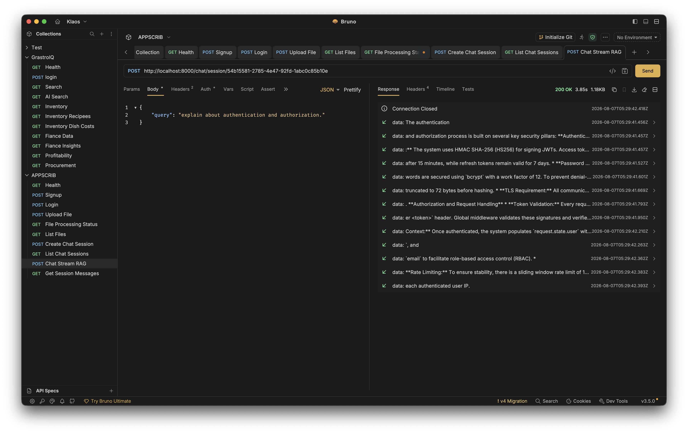

---

### Consecutive Duplicate Query Short-Circuit (`POST /chat/session/{session_id}`)
Detects back-to-back duplicate queries and instantly serves the cached assistant response from Redis (<50ms response time, $0 LLM cost).

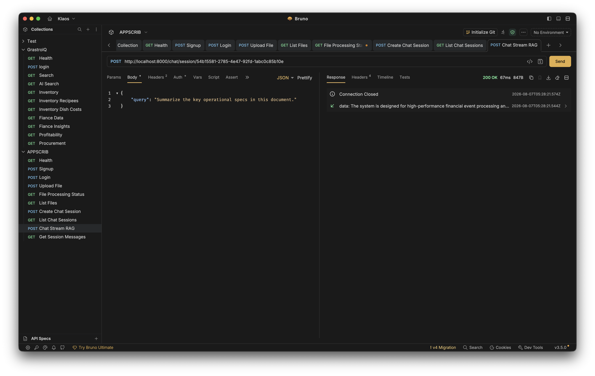

---

## 5. Error Telemetry & Database Logging

### Error Logs Table (`Supabase PostgreSQL`)
Global FastAPI exception middleware catches all 4xx HTTP responses and 500 unhandled crashes, capturing `timestamp`, `endpoint`, `http_method`, `error_message`, `stack_trace`, `ip_address`, and `user_id` in the `error_logs` table.

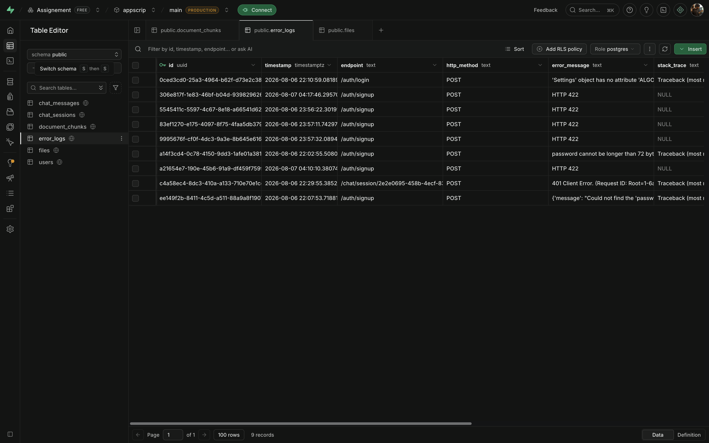
